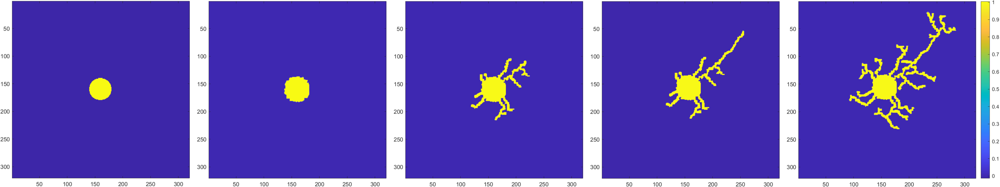

# NeuronGrowth_IGAcollocation
2D Multi-stage neuron growth using Phase-field model implemented using isogeometric collocation method (IGA-collocation).

## User Guide
This code is the implementation of the phase field model using isogeometric collocation to simulate multiple stages of neuron growth by considering the effect of tubulin. The stages modeled include lamellipodia formation, initial neurite outgrowth, axon differentiation, and dendrite formation considering the effect of intracellular transport of tubulin on neurite outgrowth. The gradient computation of Φ is carried out using cubic B-splines to increase the smoothness of the solution.

## File structures
- **[Neuron_Growth_Code](https://github.com/CMU-CBML/NeuronGrowth_IGAcollocation/tree/main/Neuron_Growth_Code)**: contains the implementation of 2D Phase field model for neuron growth code using isogeometric collocation method.
- **[Simulation_Cases_in_paper](https://github.com/CMU-CBML/NeuronGrowth_IGAcollocation/tree/main/Simulation_Cases_in_paper)**: contains simulation cases used in paper (see below). Each case can be reproduced by using the same random seed saved in the folder.
	- **case_Xneuron_X_paper**: contains code and saved data necessary to reproduce simulation results shown in the paper.
- **[IGA_collocation_algorithm](https://github.com/CMU-CBML/NeuronGrowth_IGAcollocation/tree/main/IGA_collocation_algorithm)**: contains necessary functions built and used in the model.

## How to run
1. Valid installation of Matlab (code written with Matlab 2021a)
2. Navigate to **[Neuron_Growth_Code](https://github.com/CMU-CBML/NeuronGrowth_IGAcollocation/tree/main/Neuron_Growth_Code)**
3. Run *main.m*. For simulation cases in paper, run *main.m* in each folder for that specific case.
4. Note that cases were ran on Extreme Science and Engineering Discovery Environment (XSEDE) server, which limits wall time to 48 hrs, so most simulations required a restart. To reproduce exact results, please load the saved random seed at correct iterations based on the log file.

## 
The matlab code implemented banded matrix calculation to speed up multiplications. To see the full equations, please refer to our paper:
- *Modeling Neuron Growth Using Isogeometric Collocation Based Phase Field Method* (in preparation)
